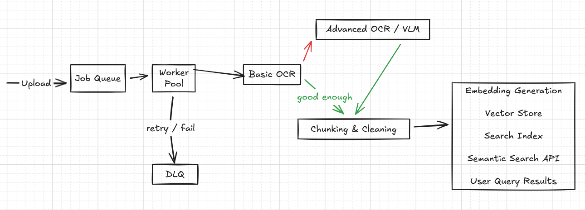

# If your AI product only works when nothing fails, it’s not a product

I started this project for a very mundane reason: searching through seniors’ and classmates’ notes was painful. PDFs, PPTs, random scans in random folders. Keyword search barely worked, and structure was nonexistent.

Like most people, my first idea was naïve but appealing:

> extract text, generate embeddings, put them in a vector database, and build semantic search on top.

That approach works in demos. It collapses in production.

Once real documents and real users enter the system, the “AI” part becomes the smallest concern. What matters is everything around it.

---

## The illusion of the “core AI”

When people talk about AI-powered document search, they usually point to:

* Semantic search
* OCR + VLMs
* Embeddings
* AI-powered retrieval

These are important, but they are not what determines whether the system actually works day after day.

In practice, they’re dependencies.

---

## What actually makes or breaks the system

The system fails in far more boring and far more dangerous ways:

* A worker crashes mid-job and the document is processed twice
* The same PDF is uploaded again and corrupts existing state
* OCR slows down or gets rate-limited and backs up the pipeline
* Data from one institute leaks into another due to bad isolation
* One page of a document fails OCR while the rest succeeds
* Cached results mix tenants or model versions
* A model or prompt changes and old documents need reprocessing

None of these problems are solved by better prompts or larger models.

They’re solved with **distributed systems design**.

---

## A system, not a pipeline

The important detail isn’t the boxes, it’s the **failure paths**.

Retries, dead-letter queues, idempotency, and partial success are not edge cases. They are the default behavior in real systems.

---

## The real takeaway

Most “AI systems” are just distributed systems pretending to be ML products.

The model is rarely the bottleneck.
The system almost always is.

Once you accept that, your design priorities change:

* Failure handling becomes a first-class feature
* Idempotency is designed in, not bolted on
* Isolation and access control are non-negotiable
* Reprocessing is expected, not feared

That’s when an AI project starts behaving like real software.

---

## Closing

If you’re building AI products and spending most of your time tuning prompts while ignoring retries, isolation, and failure modes, you’re optimizing the wrong layer.

And if this all sounds obvious, you’ve probably shipped something that broke in production already.

If you’re interested in pushing this project further (especially on frontend or UX for search-heavy tools). Feel free to reach out.
